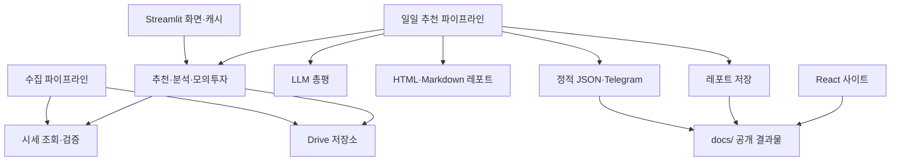

# 디렉토리 구조와 모듈 경계 — v3.64

## 공통 패키지

| 이전 루트 파일 | 현재 경로 | 역할 |
| --- | --- | --- |
| `config.py` | `src/invest_assistant/config.py` | 환경 설정 |
| `data_fetcher.py` | `data/market.py`, `universe.py`, `pipelines/collect.py` | 외부 시세 조회·공통 종목 정의·수집 실행 분리 |
| `data_quality.py` | `data/quality.py` | OHLCV 검증 |
| `news_fetcher.py` | `data/news.py` | 뉴스 조회·캐시 |
| `drive_db.py` | `storage/drive.py` | Drive API·Parquet·JSON 저장 |
| `signal_engine.py` | `analysis/signals.py` | 지표·매매 판정·수량 계산 |
| `backtest.py` | `analysis/backtest.py`, `pipelines/backtest.py` | 분석 함수·수동 실행 분리 |
| `recommendation_engine.py` | `recommendations/engine.py`, `pipelines/recommend.py` | 개별 추천·일일 실행 흐름 분리 |
| `llm_briefing.py` | `recommendations/briefing.py` | LLM 설명·총평·매크로 이슈 |
| `paper_trading.py` | `portfolio/paper.py` | 모의투자 포지션·손익 |
| `report_builder.py` | `reporting/report.py`, `storage/reports.py` | HTML·Markdown 구성과 저장·조회 분리 |
| `chart_builder.py`, `blog_chart_builder.py` | `reporting/charts.py`, `reporting/blog_charts.py` | 공통 차트 |
| `static_export.py`, `telegram_notifier.py` | `publishing/static.py`, `publishing/telegram.py` | 공개 JSON·Telegram |

표의 축약 경로는 `src/invest_assistant/` 아래입니다. 패키지 import는
`from invest_assistant.analysis import signals`처럼 사용합니다. 이전 루트 모듈은 남기지 않습니다.

## 의존성과 실행 흐름

총평은 일일 파이프라인이 한 번 생성해 HTML과 정적 JSON에 전달합니다.
레포트 렌더러와 정적 JSON 출력기는 LLM을 직접 호출하지 않습니다.
레포트 차트용 시세 조회·지표 계산은 현재 `reporting/report.py`에 남아 있습니다.
백테스트의 데이터 준비·요약 저장 함수도 `analysis/backtest.py`에 남고, 명령 실행부를 먼저 분리했습니다.
공통 패키지는 Streamlit을 import하지 않습니다.

## Streamlit

`apps/streamlit/app.py`가 한 화면의 6개 탭을 연결합니다. `tabs/`는 멀티페이지 라우팅이 아닙니다.

- `tabs/`: 소개, 대표 자산군, 개별 종목, 데이터 적재, 레포트, 모의투자 렌더링.
- `components/ticker_chart.py`: 공통 차트·추천 표시.
- `components/log_viewer.py`: 수집 진행 로그.
- `services.py`: Drive 연결 및 조회·추천 캐시.
- `constants.py`: 기간 선택과 지표 설명.

기존 위젯 키, 세션 상태, 폼 제출, 캐시 TTL을 유지합니다.
공개 서버용 사용자 인증·관리자 권한·사용자별 포지션 분리는 이번 리팩토링에서 추가하지 않았습니다.

## 경로와 산출물

`paths.py`가 저장소 루트와 `docs/`, `artifacts/`를 결정합니다.
설치형 컨테이너는 `INVEST_ASSISTANT_HOME=/app`을 사용합니다.
기본 OAuth 파일 경로와 `.env`는 이 루트를 기준으로 찾으며, 명시적인 OAuth 환경변수 경로는 그대로 사용합니다.

| 이전 위치 | 현재 위치 |
| --- | --- |
| `web/` | `apps/web/` |
| `prediction_model/` | `research/prediction_model/` |
| `lab/` | `research/notebooks/` |
| `backtest_cache/` | `artifacts/cache/backtest/` |
| `prediction_model/ohlcv_cache/` | `artifacts/cache/prediction/` |
| `prediction_model/models/` | `artifacts/models/prediction/` |
| 모델 CSV·NPZ 데이터 | `artifacts/datasets/` |
| `spec_archive/` | `documentation/specs/archive/` |
| 루트 설치·배포 가이드 | `documentation/guides/` |

GitHub Pages URL과 `docs/data/`, `docs/reports/` 형식은 유지합니다.
Vite의 출력 경로는 `../../docs`, Actions의 React 작업 경로는 `apps/web`입니다.
연구 스크립트는 `python -m research.prediction_model.feature_engineering`처럼 실행합니다.

## 검증 범위

기존 데이터 품질·LLM 타임아웃 테스트, 패키지 경계 통합 테스트, Streamlit AppTest와 React 빌드를 사용합니다.
실제 Drive 갱신·LLM 호출·Telegram 발송은 회귀 테스트에서 대체합니다.
Docker 이미지의 실제 서버 배포는 별도 운영 검토 후 진행합니다.
