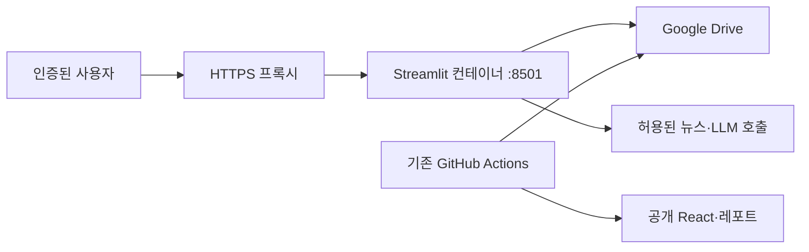

# Streamlit 서버 배포 검토

검토일: 2026-09-12. 대상: v3.64 리팩토링 이후 코드.
이 문서는 배포 설계 검토이며 서버 생성, 비밀값 등록, 외부 공개는 실행하지 않았다.

## 권장 방향

**현재 React는 공개 조회용으로 유지하고, Streamlit은 우선 본인 전용 비공개 앱으로 배포하는 것이 적절하다.**
비용과 설정을 최소화한 시험 운영은 Community Cloud 비공개 앱,
항상 켜져 있는 운영 도구와 서버 제어가 필요하면 GCP Compute Engine + Docker를 권장한다.
이 추천은 현재 코드의 관리·쓰기 기능과 기존 GCP 배포 자료를 근거로 한 판단이다.
현재 GCP 계정의 인스턴스·청구 상태를 조회한 결과는 아니다.

모든 사람에게 공개하는 Streamlit 앱은 다음의 권한·동시성 보완 이후 단계로 잡는다.

## 1. 배포 준비 상태

| 항목 | 확인 결과 |
| --- | --- |
| 앱 실행 경로 | `apps/streamlit/app.py` |
| Python 설치 | `pip install -e .` 또는 `pip install .`로 공통 패키지 설치 가능 |
| UI | 한 화면 6개 탭, 기존 캐시·폼·세션 상태 유지 |
| 검증 | 로컬 14개 테스트 통과, GitHub Ubuntu/Python 3.11에서 설치·테스트 통과 |
| React | 로컬 빌드와 GitHub 배포 성공 |
| Docker | Dockerfile·Compose 경로 갱신, Compose 설정 검사 통과 |
| 컨테이너 실행 | 로컬 Docker 엔진이 실행 중이지 않아 이미지 빌드·실행은 미검증 |
| 외부 서비스 | 실제 서버에서 Drive·Exa·LLM 연결은 미검증 |
| 접근 제어 | 앱 코드에 로그인·관리자 역할 구분 없음 |

확인 근거: [앱](../../apps/streamlit/app.py), [캐시 서비스](../../apps/streamlit/services.py),
[Dockerfile](../../infrastructure/Dockerfile), [Compose](../../infrastructure/docker-compose.yml),
[Python CI](https://github.com/garam827/ai_invest_assistant/actions/runs/34657595782),
[React 배포](https://github.com/garam827/ai_invest_assistant/actions/runs/34657595775).

## 2. 배포 방법 비교

| 방식 | 장점 | 이 프로젝트에서 고려할 점 | 판단 |
| --- | --- | --- | --- |
| Streamlit Community Cloud | 서버 관리 없이 GitHub 연결, HTTPS 주소, 무료 서비스 | 비활성 12시간 후 절전, 리소스 제한, 미국 호스팅, 패키지 설치 선언 필요 | 본인 전용 시험 운영에 우선 |
| GCP Compute Engine + Docker | 실행 시간·디스크·프로세스·도메인 구성 제어 | VM·디스크·네트워크 비용, OS·HTTPS·로그 관리 필요 | 상시 운영에 우선 |
| GCP Cloud Run | 컨테이너 기반 관리형 실행 | WebSocket 타임아웃·재연결·세션 상태·토큰 파일 처리 필요 | 초기 배포의 우선순위는 낮음 |

Community Cloud의 절전 및 자원 제한은 [앱 관리 문서](https://docs.streamlit.io/deploy/streamlit-community-cloud/manage-your-app),
미국 호스팅은 [제한 사항](https://docs.streamlit.io/deploy/streamlit-community-cloud/status)에 따른다.
무료 제공 여부는 [공식 Community Cloud 소개](https://streamlit.io/cloud)에서 확인할 수 있다.
리소스 한도는 변경될 수 있어 과거의 특정 RAM 수치를 고정 보장치로 사용하지 않았다.

Cloud Run은 WebSocket을 지원하지만 기본 5분·최대 60분의 요청 제한이 적용된다.
재접속의 세션 선호도는 보장되지 않으며, 열린 연결은 인스턴스를 활성 상태로 유지해 비용에 영향을 준다.
따라서 현재 메모리 기반 세션 상태를 그대로 두고 자동 확장만 켜는 구성은 피하는 편이 좋다.
[Cloud Run WebSocket 공식 문서](https://docs.cloud.google.com/run/docs/triggering/websockets)

## 3. 코드에서 확인한 배포 전 보완 사항

### OAuth 토큰 저장 권한 — 모든 서버 배포에서 우선 확인

Compose는 `token.json`을 `/app/token.json:ro`로 마운트한다.
그런데 `storage/drive.py::_load_credentials()`는 액세스 토큰 갱신 이후 같은 파일에 다시 쓴다.
따라서 갱신 분기가 실행되면 읽기 전용 파일 오류가 발생할 수 있다.
단순히 첫 접속만 성공하는 것으로 인증 운영 검증을 끝내면 안 된다.

권장 변경은 OAuth 클라이언트 설정은 읽기 전용으로 유지하고, 토큰은 쓰기 가능한 영속 디렉토리에 두는 것이다.
Secret Manager의 읽기 전용 마운트를 선택한다면 시작 시 쓰기 가능한 작업 파일로 복사하는 흐름이 필요하다.
동시 갱신 시에는 잠금·원자적 저장도 고려한다.
[인증 코드](../../src/invest_assistant/storage/drive.py), [현재 마운트](../../infrastructure/docker-compose.yml)

토큰이 없거나 재인증이 필요하면 현재 코드는 로컬 브라우저 인증 서버를 띄운다.
헤드리스 서버에서는 사전에 갱신 가능한 토큰을 준비하고, 재인증이 필요한 경우 명확한 운영 오류로 처리해야 한다.
외부 사용자 유형의 OAuth 동의 화면이 Testing 상태이고 Drive 범위를 요청한다면 refresh token의 7일 만료 조건도 확인해야 한다.
현재 프로젝트의 OAuth 게시 상태는 확인하지 않았다.
[Google OAuth 토큰 만료 조건](https://developers.google.com/identity/protocols/oauth2)

### 사용자·관리자 권한 — 여러 사람에게 공유하기 전에 필요

현재 데이터 적재 버튼은 접속자 누구나 전체 수집을 실행할 수 있다.
모의투자는 하나의 `_paper_trades.json`을 모든 접속자가 공유하며 사용자 소유자 구분이 없다.
로그인을 추가하는 것만으로 포지션이 사용자별로 분리되지는 않는다.

본인 전용이라면 앱 전체의 접근을 본인 계정으로 제한한다.
조회자를 추가할 때는 서버에서 데이터 적재·포지션 변경 권한을 검사하고,
개인 포지션을 제공하려면 저장 구조와 캐시 키에 사용자 식별자를 추가해야 한다.
포지션 파일의 읽기→변경→전체 저장 사이에 동시 수정이 발생하면 업데이트가 유실될 수 있으므로
여러 작성자를 허용할 때는 직렬화 또는 트랜잭션 가능한 저장소가 필요하다.
[수집 UI](../../apps/streamlit/tabs/collection.py), [모의투자 저장 코드](../../src/invest_assistant/portfolio/paper.py)

### Drive 클라이언트 동시 접근 — 여러 세션 전에 필요

`get_drive_db()`는 전역 `st.cache_resource`로 하나의 Drive 클라이언트를 재사용한다.
Streamlit의 공유 자원은 스레드 안전해야 하며, google-api-python-client의 기본 `httplib2.Http`는 스레드 안전하지 않다.
현재 구성이 여러 접속 세션에서 안전하다고 간주할 수 없다.
요청 스레드별 HTTP 전송 객체를 사용하거나 클라이언트 접근을 명시적으로 직렬화하는 변경을 권장한다.
세션별 클라이언트도 대안이지만, 토큰 파일 갱신과 공유 파일 쓰기의 동시성은 별도로 처리해야 한다.
[Streamlit 캐시](https://docs.streamlit.io/develop/concepts/architecture/caching),
[Google API 클라이언트 스레드 안전성](https://googleapis.github.io/google-api-python-client/docs/thread_safety.html)

### 뉴스·LLM 사용 범위 — 공유 시 비용 통제

차트 조회와 뉴스/분석 버튼은 이미 분리돼 있다. 추천은 티커·최신 날짜·LLM 사용 여부로 캐시된다.
그러나 캐시는 사용자별 할당량이나 비용 상한이 아니다.
`STREAMLIT_ENABLE_LLM=false`는 LLM 서술만 끄며 뉴스 조회까지 끄는 설정은 아니다.
외부 호출 없이 조회만 제공하려면 뉴스/분석 동작 자체를 제한하거나 이미 생성된 결과를 보여줘야 한다.
[공통 차트 UI](../../apps/streamlit/components/ticker_chart.py), [추천 캐시](../../apps/streamlit/services.py)

### 서버 운영 설정

상시 운영 시 HTTPS와 접근 인증, 헬스체크, 로그 회전, 재시작 정책을 구성한다.
현재 Compose의 재시작 정책은 있지만 Dockerfile의 헬스체크는 없다.
외부에 8501을 직접 열기보다는 HTTPS 프록시를 통해 연결하는 구성을 권장한다.
공식 Docker 예시는 `/_stcore/health`를 상태 검사에 사용한다.
[Streamlit Docker 배포 문서](https://docs.streamlit.io/deploy/tutorials/docker)

## 4. Community Cloud로 시험 운영할 경우

1. **접근 대상:** 처음에는 본인만 허용한 비공개 앱으로 설정한다. 공식 정책상 비공개 앱은 한 번에 하나다.
2. **배포 선택:** 저장소 `garam827/ai_invest_assistant`, 브랜치 `master`, 실행 파일 `apps/streamlit/app.py`, Python 3.11.
3. **패키지 설치:** 앱 옆 `apps/streamlit/requirements.txt`에 로컬 프로젝트 설치를 선언하는 구성을 추가한다. 제안 내용은 `-e .`이며, 저장소 루트에서 설치하는 조건으로 검증한다.
4. **Secrets:** Drive 폴더 ID, OAuth 클라이언트 JSON·토큰 JSON, 사용하는 기능의 Exa·LLM 키를 관리 화면에 등록한다. 실제 값은 Git에 넣지 않는다.
5. **시작 검사:** Drive 조회, 6개 탭, 차트 조회, 토큰 갱신을 확인한다. 장시간 전체 종목 수집은 기존 GitHub Actions에 맡긴다.
6. **절전·재기동 검사:** 앱을 재시작해도 재인증 없이 실행되는지 확인한다. 로컬 작업 파일만을 영구 보관소로 간주하지 않는다.

현재 루트 `requirements.txt`는 외부 라이브러리만 설치한다. 패키지화 이후에는 이것만 설치하는 환경에서
`invest_assistant` import가 실패할 수 있으므로 3번이 필요하다. 이는 현재 파일과 플랫폼 설치 순서에 근거한 판단이다.
Community Cloud는 실행 파일 디렉토리의 의존성 파일을 먼저 찾고, 없으면 루트를 찾으며, 앱은 저장소 루트에서 실행한다.
[의존성 처리](https://docs.streamlit.io/deploy/streamlit-community-cloud/deploy-your-app/app-dependencies),
[파일 배치](https://docs.streamlit.io/deploy/streamlit-community-cloud/deploy-your-app/file-organization)

비공개 설정은 앱 설정의 공유 범위에서 관리한다. Secrets의 루트 키는 환경변수로 제공되므로
현재 환경변수 기반 인증 부트스트랩에 연결할 수 있다.
[공유 설정](https://docs.streamlit.io/deploy/streamlit-community-cloud/share-your-app),
[Secrets 동작](https://docs.streamlit.io/develop/concepts/connections/secrets-management)

## 5. GCP VM으로 상시 운영할 경우

권장 시작 구성은 **단일 VM, 약 2 vCPU·RAM 4GB, 디스크 20~30GB**다.
이는 부하 테스트를 거친 최소 사양이 아니라 pandas·Plotly·다중 세션의 여유를 둔 초기 검증용 제안이다.
기존 문서의 1GB VM이 현재 앱을 안정적으로 처리한다는 실측은 없다.
서울 리전은 국내 접속 지연, 미국 리전은 비용·무료 조건을 비교해 선택한다.

VM에는 Streamlit만 상시 실행한다. 수집·일일 추천 크론을 VM에 중복 설치하지 않는다.
백테스트와 모델 학습도 UI 서버에서 실행하지 않는다.

배포 흐름은 다음과 같다.

1. 토큰 저장 권한·인증 갱신·단일 사용자 접근 제한을 먼저 보완한다.
2. 서버의 Docker 빌드 및 `/_stcore/health` 확인 후 인증된 테스트 접속을 허용한다.
3. HTTPS 도메인과 프록시의 WebSocket 전달·시간 제한을 설정한다.
4. 재시작 후 Drive 조회, 1시간 이후 인증 갱신, 여러 브라우저 세션의 차트 조회를 확인한다.
5. 메모리 사용·응답 지연·뉴스 호출량을 관찰해 캐시 상한과 서버 크기를 조정한다.
6. 배포 커밋 또는 이미지 태그를 기록하고 이전 이미지로 복구하는 절차를 준비한다.

실행 명령은 `docker compose -f infrastructure/docker-compose.yml up -d --build`이며,
현재 Compose의 토큰 마운트 문제를 수정한 뒤 사용해야 한다.

## 6. 비용 판단

현재는 대상 리전, 실제 VM 보유 여부, 사용 시간, 동시 접속 수가 정해지지 않아 확정 견적을 제시하지 않는다.

| 항목 | 예산 산정 방식 |
| --- | --- |
| Community Cloud | 호스팅 무료, 외부 Exa·LLM 비용 별도 |
| VM | 선택 인스턴스 시간당 단가 × 월 실행 시간(상시 운영 예시 730시간) |
| 디스크 | 디스크 종류·용량 × 월 단가 |
| 네트워크 | 외부 IP, 인터넷 송신, 필요 시 프록시·로드밸런서 등 추가 비용 |
| 외부 API | 실제 뉴스·LLM 호출 횟수와 모델·요금제 |
| Cloud Run | 활성 연결 시간·CPU·메모리·빌드·이미지 저장 등을 함께 산정 |

VM 비용은 인스턴스만 비교하면 부족하다. 기존 무료 VM 자료만으로 전체 운영비가 0원이라고 가정하지 않는다.
[Compute Engine 가격](https://cloud.google.com/products/compute/pricing),
[네트워크 가격](https://cloud.google.com/vpc/network-pricing),
[Cloud Run 가격](https://cloud.google.com/run/pricing)

## 7. 다음 작업의 범위

시험 운영을 선택하면 Community Cloud용 설치 선언, 본인 전용 접근 설정, OAuth 재시작·갱신 검증이 우선이다.
상시 VM 운영을 선택하면 토큰 영속 저장, 클라이언트 동시성, HTTPS·접근 인증·헬스체크를 먼저 구현한다.
여러 사람의 모의투자까지 제공하는 것은 사용자별 저장 구조를 포함한 별도 기능 확장이다.

이번 검토에서는 이들 변경이나 실제 서버 배포를 실행하지 않았다.
