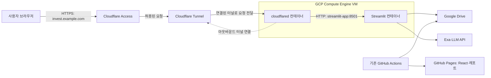

# Streamlit GCP·Cloudflare 운영 명세

버전: **v1.0 — 2026-09-12**  
상태: **설계 완료, 구현·배포 전**  
관련 프로젝트 명세: [v3.65](investment_assistant_spec.md)

## 1. 목적과 확정 구조

Streamlit은 **GCP Compute Engine VM의 Docker 컨테이너**에서 실행한다.
사용자는 **Cloudflare에 연결한 도메인**으로 접속하고, Cloudflare Access의 인증을 통과한 뒤
Cloudflare Tunnel을 통해 Streamlit을 이용한다.

Cloudflare는 도메인·외부 HTTPS·접속 인증·요청 전달을 담당한다.
애플리케이션의 Python 코드 실행과 캐시·세션은 GCP VM에서 담당한다.
Cloudflare Workers·Pages·Containers와 Streamlit Community Cloud는 이번 배포 대상으로 사용하지 않는다.

Tunnel은 VM에서 시작하는 아웃바운드 연결을 사용한다.
Streamlit에 접속하기 위한 VM의 인바운드 80·443·8501 포트 개방은 필요하지 않다.
[Cloudflare Tunnel 구조](https://developers.cloudflare.com/tunnel/)

## 2. 초기 운영 범위

| 항목 | 명세 |
| --- | --- |
| 사용자 | 초기에는 운영자 본인 1명 |
| 접근 방식 | 허용한 이메일로 Cloudflare Access 인증 |
| 앱 | 기존 Streamlit 단일 화면·6개 탭 |
| 데이터 | 기존 Google Drive 저장소 사용 |
| 일일 수집·추천 | 기존 GitHub Actions에서 실행 |
| 공개 조회 사이트 | 기존 React·GitHub Pages 유지 |
| 데이터 적재·모의투자 변경 | 인증된 운영자만 사용 |
| 백테스트·모델 학습 | 기존 수동 연구 작업으로 유지, UI 서버에서 정기 실행하지 않음 |
| 확장 | 다중 사용자별 포지션·역할 구분은 후속 범위 |

Access의 로그인은 앱 전체의 입장 권한을 통제한다. 사용자별 포지션이나 앱 내부 역할을 자동으로 만들지 않는다.
초기 운영 중 다른 사람을 Access 허용 목록에 추가하면 그 사람도 현재 앱의 관리 기능을 사용할 수 있으므로,
추가 사용자를 허용하기 전에 앱 내부 권한과 데이터 분리를 별도로 구현해야 한다.

## 3. 구성 요소별 책임

| 구성 요소 | 책임 |
| --- | --- |
| GCP VM | Docker 실행, 재시작, 영속 디스크, 서버 로그 |
| `streamlit-app` | UI, 지표·추천 조회, 운영자의 수동 작업 |
| `cloudflared` | Cloudflare 연결 유지, Access 토큰 검증, 내부 앱으로 전달 |
| Cloudflare DNS | 외부 접속용 호스트 이름과 Tunnel 연결 |
| Cloudflare Access | 로그인, 이메일 허용 정책, 접속 세션 |
| Google Drive | 시세, 추천 이력, 레포트, 모의투자 데이터 |
| GCP Secret Manager | OAuth 초기 인증값·외부 API 키·Tunnel 토큰 보관 |
| GitHub Actions | 기존 수집·추천·레포트·React 배포 자동화 |

## 4. 도메인·DNS·네트워크

### 4.1 외부 접속 주소

- 예시 호스트: `invest.example.com`. 실제 도메인과 서브도메인은 배포 전에 정한다.
- 다른 등록업체에서 구매한 도메인도 사용할 수 있으며, 기본 설계는 해당 DNS 존을 Cloudflare에서 관리하는 방식이다.
- 원격 관리형 Named Tunnel을 생성하고, 공개 호스트 이름을 Tunnel에 연결한다.
- DNS 연결 대상은 Tunnel이며 VM 공인 IP를 가리키는 직접 접속용 A 레코드를 만들지 않는다.
- 테스트용 임시 Quick Tunnel URL은 운영 주소로 사용하지 않는다.

### 4.2 내부 라우팅

| 항목 | 값 |
| --- | --- |
| Cloudflare 공개 호스트 | `invest.example.com` — 예시 |
| Tunnel 원본 서비스 | `http://streamlit-app:8501` |
| Streamlit 컨테이너 수신 | `0.0.0.0:8501` |
| Docker 네트워크 | 두 컨테이너가 공유하는 Compose 네트워크 |
| VM 호스트 포트 게시 | 운영 구성에서는 `ports: 8501:8501` 제거 |

`cloudflared`를 별도 컨테이너로 실행하므로 원본 주소에 `localhost:8501`을 사용하지 않는다.
같은 Docker 네트워크의 서비스 이름 `streamlit-app`을 사용한다.
브라우저와 Cloudflare 사이에는 HTTPS를 사용하고, 동일 VM 내부 컨테이너 구간은 HTTP로 연결한다.
[호스트 이름과 원본 서비스 연결](https://developers.cloudflare.com/tunnel/setup/)

### 4.3 방화벽과 외부 통신

- Streamlit 직접 접근용 인바운드를 허용하지 않는다. 서버 관리 접속은 IAP 등 별도 관리 경로로 제한한다.
- Tunnel 연결용 아웃바운드 TCP·UDP 7844를 허용한다.
- Google·Cloudflare 인증 및 API, Exa·LLM, 이미지·패키지 다운로드에 필요한 HTTPS 443과 DNS 통신을 허용한다.
- VM에 공인 IP가 없어도 되지만, 그 경우 외부 API와 Tunnel에 도달할 아웃바운드 경로가 필요하다.
- 초기 네트워크 선택은 기존 VPC·공인 IP 또는 Cloud NAT 구성을 확인한 뒤 정한다. NAT 비용도 견적에 포함한다.

7844 연결 요건은 [Cloudflare 방화벽 명세](https://developers.cloudflare.com/cloudflare-one/networks/connectors/cloudflare-tunnel/configure-tunnels/tunnel-with-firewall/)를 따른다.

## 5. Access 인증 정책

| 설정 | 요구사항 |
| --- | --- |
| 애플리케이션 유형 | Self-hosted application |
| 보호 대상 | 운영 호스트의 전체 경로 |
| 허용 정책 | 운영자 이메일 정확히 1개를 초기 허용 목록으로 지정 |
| 그 외 사용자 | 기본 거부 |
| 로그인 수단 | 이메일 일회용 코드 또는 연결된 Google 로그인 중 선택 |
| Access 세션 | 초기 제안 8시간, 실제 운영 설정에서 확정 |
| 예외 정책 | 전체 공개·인증 우회 정책을 만들지 않음 |
| 원본 검증 | `cloudflared`의 Protect with Access를 사용해 JWT·대상 AUD를 검증 |

DNS·Tunnel 경로를 활성화하기 전에 Access 보호 정책을 준비한다.
Access의 팀 이름과 애플리케이션 AUD를 Tunnel 원본 검증 설정과 일치시킨다.
유효한 인증 토큰이 없거나 검증할 수 없으면 원본에 요청을 전달하지 않는다.
[원본에서 Access 토큰 검증](https://developers.cloudflare.com/tunnel/advanced/origin-parameters/)

Access 로그인과 Google Drive OAuth는 별개다. 사용자의 로그인 성공이 Drive 접근 권한을 대신하지 않는다.
열려 있는 WebSocket이 Access 세션 만료 즉시 끊어진다고 가정하지 않으며,
재접속·세션 만료·권한 취소 시 실제 동작을 인수 테스트에서 확인한다.

## 6. VM·컨테이너 실행 환경

| 항목 | 초기 제안 |
| --- | --- |
| VM 개수 | 1개 |
| 자원 | 약 2 vCPU·RAM 4GB, 부하 검증 후 조정 |
| 디스크 | 20~30GB 영속 디스크, 로그와 이미지 사용량 감시 |
| OS | Docker를 지원하는 유지보수 중 Linux 배포판 |
| Python | 현재 코드·CI와 맞춘 3.11 기반 컨테이너 |
| 앱 실행 | `streamlit run apps/streamlit/app.py` |
| 프로젝트 경로 | 컨테이너 `/app`, `INVEST_ASSISTANT_HOME=/app` |
| 컨테이너 | `streamlit-app`, `cloudflared` 각각 1개 |
| 재시작 | VM 재부팅 후 Docker 및 두 서비스 자동 시작 |
| 이미지 버전 | 검증한 태그 또는 digest 기록, 운영 배포는 버전 고정 |

제안 사양은 최소 보장 사양이나 성능 측정 결과가 아니다. VM 리전·머신 유형은 비용과 국내 접속 지연을 비교해 확정한다.
초기에는 단일 앱 인스턴스를 사용한다. 복제본·자동 확장은 세션과 데이터 쓰기 동시성 설계 이후에 도입한다.

Streamlit의 CORS·XSRF 보호를 연결 오류 해결 목적으로 무조건 끄지 않는다.
도메인과 WebSocket 연결을 먼저 확인한다. 동적 화면과 인증 응답에 Cache Everything 규칙을 적용하지 않는다.
Cloudflare Tunnel의 WebSocket 지원을 사용한다.
[WebSocket 지원](https://developers.cloudflare.com/cloudflare-one/faq/cloudflare-tunnels-faq/)

## 7. 인증값·환경변수·영속 저장

### 7.1 설정 목록

| 설정 | 용도 |
| --- | --- |
| `INVEST_ASSISTANT_HOME` | `/app` |
| `DRIVE_FOLDER_ID` | 기존 Drive 데이터 폴더 |
| `GOOGLE_OAUTH_CLIENT_SECRET_PATH` | 읽기 전용 OAuth 클라이언트 설정 파일 |
| `GOOGLE_OAUTH_TOKEN_PATH` | 쓰기 가능한 영속 디렉토리의 토큰 파일 |
| `LLM_PROVIDER`, 모델 설정, 해당 API 키 | 기존 프로바이더 설정 유지 |
| `EXA_API_KEY` | 뉴스 조회 |
| `STREAMLIT_ENABLE_LLM` | 초기 운영에서는 명시적으로 설정 |
| `LLM_REQUEST_TIMEOUT_SEC` | 기존 기본값 180초 유지 |
| Tunnel 실행 토큰 | `cloudflared` 컨테이너에만 전달 |
| Access 팀 이름·AUD | 원본 JWT 검증 설정 |

실제 비밀값은 Git·명세·이미지에 저장하지 않는다. VM 서비스 계정에는 필요한 개별 Secret을 읽을 최소 권한만 부여한다.
서버 시작 시 비밀값을 실행 환경이나 권한 제한 파일로 제공한다.
앱 컨테이너에 Tunnel 관리 자격 증명을 전달하지 않는다.

### 7.2 OAuth 토큰 저장

현재 Compose의 `token.json:ro`는 운영 목표와 맞지 않으므로 변경해야 한다.
Drive 클라이언트는 인증 갱신 후 토큰 파일을 다시 쓰기 때문이다.

- 클라이언트 설정 JSON은 읽기 전용으로 마운트한다.
- 토큰은 별도의 영속 디렉토리로 마운트하고, 앱 실행 사용자만 읽고 쓸 수 있게 한다.
- 예시 컨테이너 경로는 `/var/lib/ai-invest/oauth/token.json`이며 환경변수로 지정한다.
- 최초 토큰만 Secret Manager에서 초기화하고, 정상적으로 갱신된 토큰을 재시작 때 과거 초기값으로 덮어쓰지 않는다.
- 동시 갱신은 잠금으로 보호하고, 임시 파일 작성 후 교체하는 방식으로 저장한다.
- 토큰이 없거나 재동의가 필요하면 헤드리스 서버에서 브라우저를 띄우지 않고 운영자가 조치할 수 있는 오류를 표시한다.
- OAuth 동의 화면의 게시 상태와 refresh token 만료 조건을 배포 전 확인한다.

영속 볼륨은 컨테이너 재생성 이후에도 보존한다. 원격 데이터의 기준 저장소는 계속 Google Drive다.

## 8. 앱의 동시성과 수동 작업

한 명의 운영자도 여러 브라우저 탭·세션을 열 수 있다.
전역 캐시의 Drive 클라이언트를 여러 스레드가 보호 없이 공유하지 않도록 수정한다.
스레드별 HTTP 전송 객체 또는 명시적인 접근 직렬화를 적용하고, OAuth 갱신 잠금도 함께 처리한다.

모의투자의 읽기→변경→저장을 앱 프로세스 내에서 직렬화한다.
초기에는 앱을 단일 인스턴스로 운영하고, GitHub Actions는 모의투자 포지션을 변경하지 않는다.
전체 수집 버튼의 중복 실행은 막고, 정기 수집은 기존 Actions에 맡긴다.
VM 수동 수집과 정기 Actions가 겹치지 않도록 수동 수집 전 실행 상태를 확인한다.

뉴스·LLM 호출은 기존 명시적 버튼과 캐시를 유지한다.
`STREAMLIT_ENABLE_LLM=false`만으로 뉴스 조회까지 비활성화되지는 않는다는 점을 운영 설정에 반영한다.
추가 사용자별 사용량 제한은 다중 사용자 기능 확장 시 설계한다.

## 9. 구현 대상 파일

아래는 구현 단계의 변경 목록이다. 본 명세 작성으로 해당 설정이 적용된 것은 아니다.

| 파일·영역 | 필요한 변경 |
| --- | --- |
| `infrastructure/docker-compose.yml` | `cloudflared` 서비스·공유 네트워크·영속 토큰 디렉토리 추가, 앱 호스트 포트 게시 제거 |
| `infrastructure/Dockerfile` | 헬스체크와 고정 실행 설정 검토 |
| `src/invest_assistant/storage/drive.py` | 헤드리스 인증 오류 처리, 토큰 갱신 잠금·원자적 저장, HTTP 클라이언트 동시성 |
| `apps/streamlit/services.py` | Drive 자원 캐시의 동시 접근 방식 수정 |
| `apps/streamlit/tabs/collection.py` | 중복 수동 수집 방지 |
| `src/invest_assistant/portfolio/paper.py` | 모의투자 변경 직렬화 |
| `.env.example`, ignore 파일 | 비밀값 없는 설정 예시와 영속 인증 파일 제외 규칙 |
| `tests/` | 인증 갱신·동시 접근·포지션 변경 회귀 검증 |
| Cloudflare 관리 설정 | DNS·Named Tunnel·Access 정책·원본 JWT 검증 |
| GCP 관리 설정 | VM·서비스 계정·Secret 권한·방화벽·아웃바운드 경로 |

기존 지표·매수/매도 판정·리포트 구성은 변경하지 않는다.

## 10. 배포 순서

1. 실제 도메인·운영자 이메일·GCP 프로젝트·리전·VM·비용 범위를 확정한다.
2. 위 코드·Compose 보완을 구현하고 기존 테스트 및 신규 회귀 테스트를 통과시킨다.
3. GCP의 실행 환경·비밀값·영속 토큰 디렉토리를 준비한다.
4. Streamlit을 내부 네트워크에서 기동하고 `/_stcore/health`와 Drive 조회를 확인한다.
5. Cloudflare Access의 호스트 전체 보호 정책과 Named Tunnel을 설정한다.
6. `cloudflared`를 기동하고 원본 서비스·AUD·DNS를 연결한다.
7. 허용 계정과 비허용 계정으로 접속을 검증하고, VM 직접 접근이 막혀 있는지 확인한다.
8. OAuth 갱신·컨테이너 재시작·VM 재부팅·Tunnel 재접속 테스트를 수행한다.
9. 운영 주소, 배포 커밋·이미지, 장애 확인 경로와 복구 절차를 기록한다.

## 11. 인수 기준

| ID | 완료 조건 |
| --- | --- |
| A01 | 운영 도메인에서 HTTPS로 접근할 수 있다. |
| A02 | 비로그인·비허용 이메일은 Streamlit 화면과 하위 경로에 접근할 수 없다. |
| A03 | 허용된 운영자는 기존 6개 탭과 차트를 이용할 수 있다. |
| A04 | VM 공인 주소의 8501 등으로 Access를 우회할 수 없다. |
| A05 | 여러 탭에서 차트 조회 시 Drive 전송 객체 충돌이 발생하지 않는다. |
| A06 | 만료된 액세스 토큰 갱신이 읽기 전용 오류 없이 성공하고 재시작 후에도 사용할 수 있다. |
| A07 | 재동의가 필요한 인증은 무한 대기·브라우저 실행 없이 운영 오류로 처리된다. |
| A08 | 컨테이너 재생성과 VM 재부팅 후 앱·Tunnel이 복구되고 영속 토큰이 보존된다. |
| A09 | Tunnel 재접속 후 브라우저가 다시 연결되며, 유지되지 않는 화면 상태는 명확히 확인한다. |
| A10 | 초기 단일 인스턴스에서 동시 포지션 변경이 유실되지 않고, 수집 버튼 연속 클릭이 중복 실행되지 않는다. |
| A11 | 로그·Git·이미지에 OAuth 토큰·Tunnel 토큰·API 키가 포함되지 않는다. |
| A12 | 기존 회귀 테스트와 별도 테스트 데이터로 수행한 모의투자 개설·청산이 통과한다. |
| A13 | Access 세션 만료·권한 취소와 기존 WebSocket의 실제 동작을 기록한다. |
| A14 | 일일 수집·추천 Actions와 공개 React·레포트 경로가 기존대로 유지된다. |

기능 검증에 운영 포지션을 사용하지 않는다. 인증 실패·장애 테스트는 복구 가능한 테스트 설정으로 수행한다.

## 12. 운영·장애 대응

- **상태 확인:** VM 상태 → 컨테이너 상태 → 내부 헬스체크 → Tunnel 상태 → Access 정책 → 외부 접속 순서로 확인한다.
- **로그:** 앱과 Tunnel 로그를 분리하고 보관 용량을 제한한다. 비밀값을 로그에 출력하지 않는다.
- **알림:** 앱 종료, Tunnel 끊김, OAuth 재동의 필요, 디스크 부족을 운영자가 확인할 수 있게 한다.
- **복구:** 검증한 이전 앱 이미지·Compose 버전으로 되돌린다. 토큰 디렉토리를 삭제하지 않는다.
- **장애 우회:** Tunnel 장애를 이유로 Streamlit 포트를 임시 공개하지 않는다.
- **복구 목표:** 자동 재시작 후 복구 여부를 검증하며, 무중단·고가용성은 초기 단일 VM 범위에 포함하지 않는다.

## 13. 미정 항목과 비용

| 항목 | 상태 |
| --- | --- |
| 실제 도메인·서브도메인 | 미정 |
| 운영자 허용 이메일·로그인 수단 | 미정 |
| Cloudflare 계정·DNS 존·Tunnel 이름 | 미정 |
| GCP 프로젝트·리전·기존 VM 재사용 여부 | 미정 |
| VM 머신 유형·디스크 종류 | 초기 제안 후 확정 필요 |
| 공인 IP 또는 NAT 등 아웃바운드 방식 | 기존 네트워크 확인 후 결정 |
| 월 예산·결제 설정 | 미정 |
| 앱의 LLM 활성화 여부·사용 모델 | 기존 설정 확인 후 운영값 확정 |

비용은 VM 실행 시간, 영속 디스크, 외부 IP 또는 NAT, 송신 트래픽, 도메인,
선택한 Cloudflare 플랜과 Exa·LLM 사용량을 합산한다. Tunnel을 사용한다는 이유로 서버·네트워크 비용이 없어지는 것은 아니다.
세부 요금은 배포 시점의 리전·플랜으로 다시 산정한다.

이 문서는 미정 값을 임의의 실제 계정·도메인으로 채우지 않는다.
현재 단계의 산출물은 명세이며, 코드 변경·VM 생성·도메인 연결·Access 허용 설정·배포는 아직 수행하지 않았다.
