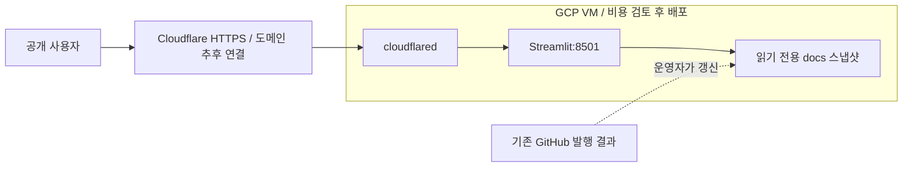

# Streamlit GCP·Cloudflare 운영 명세

버전: **v1.1 — 2026-09-13**  
프로젝트 명세: [v3.66](investment_assistant_spec.md)  
상태: 배포 코드·테스트 구현, 실제 GCP 배포 및 도메인 연결 미실행

## 확정 요구사항

- 누구나 로그인 없이 조회한다. 초기 구성에는 Cloudflare Access를 사용하지 않는다.
- 월 배포 예산은 0원이다. 기존 GCP 구성의 무료 적용 여부를 확인하기 전 자원을 생성하지 않는다.
- 도메인은 나중에 연결한다. 현재는 로컬 컨테이너 및 CI에서 검증한다.
- 공개 대상은 이미 GitHub Pages에 발행한 `docs/data/`, `docs/reports/`이다.
- 공개 앱은 소개·자산군·주식·리포트 4개 탭을 제공한다. 수집·모의투자 탭과 뉴스 생성 버튼은 노출하지 않는다.
- S&P 500 매수·매도 요약 표를 리포트에서 제외하는 기존 요구사항을 유지한다.

## 실행 구조

공개 앱은 Drive·Exa·LLM API를 호출하지 않는다. 서버에 OAuth 토큰이나 API 키를 전달하지 않는다.
기존 데이터 수집·추천 배치는 별도로 유지하며 그 배치의 API 비용을 이번 구현이 제거하지는 않는다.
공개 데이터는 실시간 시세가 아니다. 생성 시점을 표시하고 최대 5분 캐시를 사용한다.
VM의 스냅샷 갱신은 아직 자동화하지 않았으며 운영자가 저장소를 갱신해야 한다.
기존 공개 HTML 리포트 내용은 그대로 공개한다. 관리 탭 제거가 과거 리포트 내용의 삭제를 의미하지 않는다.

## 컨테이너 및 인증

Docker와 기본 Compose는 `STREAMLIT_PUBLIC_MODE=true`로 실행한다.
UID 10001, 읽기 전용 루트 파일시스템, 임시 `/tmp`, 읽기 전용 docs 마운트, 권한 제거와 로그 회전을 적용한다.
기본 Compose에는 호스트 포트·인증 파일·비밀값 마운트가 없다. 로컬 override는 127.0.0.1에만 포트를 연결한다.
선택적 Tunnel override는 별도 파일의 토큰을 사용한다. 이미지 태그/다이제스트와 토큰 경로는 명시적으로 지정한다.
`--token-file`을 지원하는 2025.4.0 이상을 사용하며 원본 주소는 `http://streamlit-app:8501`이다.
호스트의 8501 인바운드 포트를 열지 않는다. [Cloudflare 실행 인자](https://developers.cloudflare.com/tunnel/advanced/run-parameters/)

앱 메모리 한도는 기본 640 MiB, Tunnel은 128 MiB이다. 이는 1 GiB VM의 안정성이나 무료 운영을 보장하지 않는다.
실제 VM에서 장시간·동시 접속 부하를 추가 확인한다. CI는 기능·기동·재시작 검증이며 부하 시험은 아니다.

비공개 로컬 모드는 기존 6개 탭을 유지한다. OAuth 동의는 `scripts/authorize_drive.py`로 명시적으로 실행한다.
토큰은 원자적으로 교체하며 headless 환경에서 인증 브라우저를 시작하지 않는다.
Drive 전송과 모의투자 읽기·수정·쓰기는 프로세스 내부 RLock으로 직렬화하고 수집 UI는 중복 실행을 차단한다.
잠금은 단일 프로세스용이다. 여러 프로세스·서버가 동시에 같은 데이터를 쓰는 구성은 지원하지 않는다.

## 0원 예산의 배포 전 조건

GCP Free Tier는 특정 미국 리전의 e2-micro 사용량, 표준 영구 디스크 30 GB-month, 제한된 아웃바운드 트래픽 등에 적용된다.
다른 리소스와 무료 한도를 공유하므로 머신 타입만으로 무료 여부를 확정할 수 없다.
[GCP 무료 사용 조건](https://docs.cloud.google.com/free/docs/free-cloud-features)

외부 IPv4·Cloud NAT·한도 초과 트래픽에는 별도 비용이 발생할 수 있다. Tunnel이 GCP 네트워크 과금을 없애지는 않는다.
예산 알림은 강제 과금 차단이 아니며 무료 크레딧은 영구 0원 근거가 아니다.
[GCP 네트워크 요금](https://cloud.google.com/vpc/network-pricing)

확인할 정보: 프로젝트 ID, VM 이름·존·머신 타입, 디스크 종류·용량, 외부 IP 유무, NAT 유무, 무료 혜택·크레딧 상태.
0원을 충족할 수 없으면 GCP 배포를 보류하고 기존 GitHub Pages를 유지한다.
컨테이너 CI는 공개 저장소의 무료 표준 GitHub 호스팅 러너를 사용한다.
[GitHub Actions 과금](https://docs.github.com/en/billing/concepts/product-billing/github-actions)

## 검증 및 운영

- Python: 공개 UI 4개 탭과 네트워크 호출 차단, 경로 제한, 공개 쓰기 차단, 기존 비공개 UI 회귀.
- OAuth: headless 실패 처리, 갱신 후 재사용, 취소된 인증, 저장 실패 시 이전 파일 보존.
- 동시성: Drive 전송 직렬화 및 모의투자 동시 쓰기 보존.
- 컨테이너 CI: 이미지 빌드, health, 비루트·비밀값 미탑재, 실제 스냅샷 읽기, 공개 UI, 재시작.
- 실제 GCP·HTTPS·WebSocket·Tunnel 재연결·부하·요금은 배포 후 별도 인수 대상이다.

실행·갱신·복구는 [운영 가이드](../guides/PUBLIC_STREAMLIT_RUNBOOK.md)를 따른다.
이전 비공개 설계는 [v1.0 아카이브](archive/streamlit_gcp_cloudflare_spec_v1.0.md)에 보관한다.
